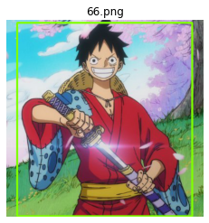
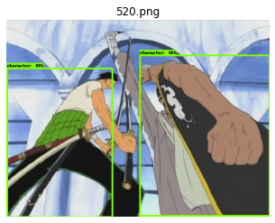
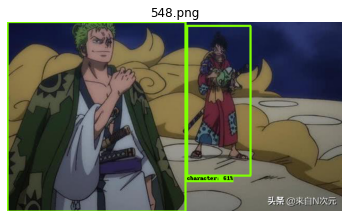
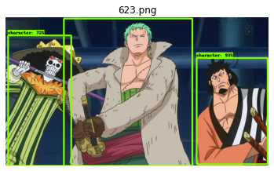
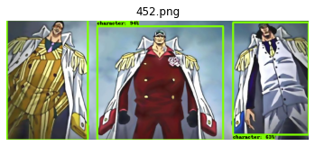
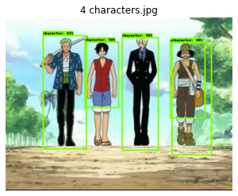
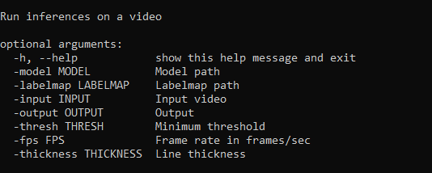

# One Piece characters detector    

An object detector trained with a Kaggle GPU on One Piece images, using Tensorflow and a fine-tuned ssd resnet50. 

> **Deployed on my [personal Docker Hub repository](https://hub.docker.com/repository/docker/ibrahimserouis/my-tensorflow-models)

> **Kaggle Notebook link:  [Kaggle notebook](https://www.kaggle.com/ibrahimserouis99/custom-object-detector-one-piece-characters)

> **One Piece Detector SavedModel : [Drive](https://drive.google.com/drive/folders/11FVvs6Z7yRLAlJgoclrUEnzlsX8uzfkB?usp=sharing)

# Model and configuration summary 

- Class count : 1
- Labels : ["character"]
- Model type : detection 
- Base model : ssd_resnet50_v1_fpn_640x640_coco17_tpu-8 

# Results : screenshots

## With 1 character

## With 2 characters 

## With 3 characters 

## With 4 characters

# Useful links 

## How to run inferences on a video : [commnand line runner](https://github.com/Justsecret123/One-Piece-characters-detector/blob/main/Scripts/op_detector_video.py)

> Note : Before running the script, you should first download the One Piece object detector model [here](https://drive.google.com/drive/folders/11FVvs6Z7yRLAlJgoclrUEnzlsX8uzfkB?usp=sharing)

### Args

### Execution example

Check the [sample command for executing the command line runner](/Scripts/op_detector_video.bat)

## Tensorflow Serving container test script 
- [On GitHub](Scripts/Prediction_OP_detection_model.py)
- [Label map](Scripts/tf_label_map.pbtxt)

## Training notebook 

- [Kaggle](https://www.kaggle.com/ibrahimserouis99/custom-object-detector-one-piece-characters)
- [GitHub](Notebooks/custom-object-detector-one-piece-characters.ipynb)

## How to concatenate mutliple TFRecord files into the Training and Validation sets 

- [Kaggle](https://www.kaggle.com/ibrahimserouis99/generate-training-and-validation-records)
- [GitHub](Notebooks/generate-the-training-and-validation-tfrecords.ipynb)

## Training pipeline configuration file : [Here](Config/pipeline_batch_size_8.config)

## Prerequisites 

- Python 3.0 or higher 
- Tensorflow 2.0 or higher 
- Tensorflow Object Detection API
- NumPy
- Matplotlib
