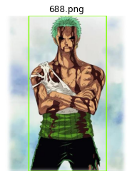
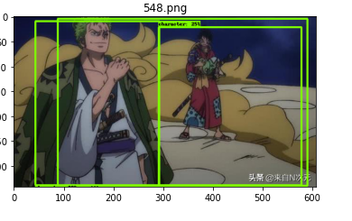

# One Piece characters detector 

An object detector trained with a Kaggle GPU on One Piece images, using Tensorflow and a fine-tuned ssd resnet50. 

# Results : screenshots

## With 1 character

## With 2 characters 

## With 3 characters 

# Useful links 

## Training notebook 

- [Kaggle](https://www.kaggle.com/ibrahimserouis99/custom-object-detector-one-piece-characters)
- [GitHub](Notebooks/custom-object-detector-one-piece-characters.ipynb)

## How to concatenate mutliple TFRecord files into the Training and Validation sets 

- [Kaggle](https://www.kaggle.com/ibrahimserouis99/custom-object-detector-one-piece-characters)
- [GitHub](Notebooks/generate-the-training-and-validation-tfrecords.ipynb)

## Training pipeline configuration file : [Here](Config/pipeline_batch_size_8.config)

## Prerequisites 

- Python 3.0 or higher 
- Tensorflow 2.0 or higher 
- Tensorflow Object Detection API
- NumPy
- Matplotlib
